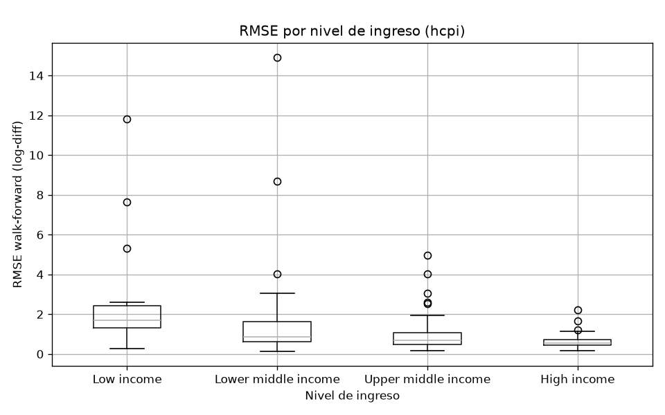
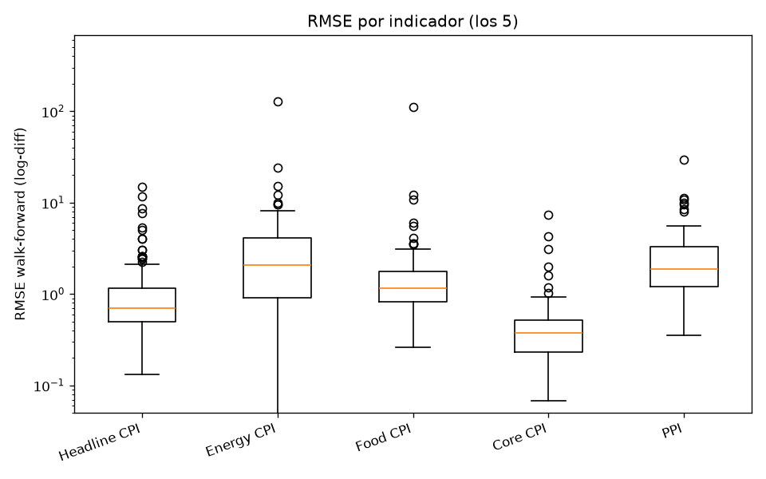
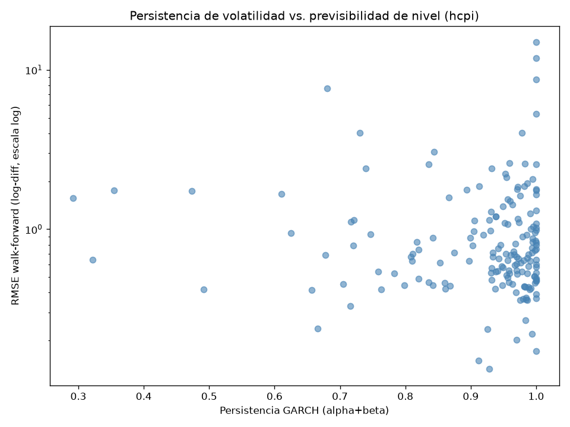
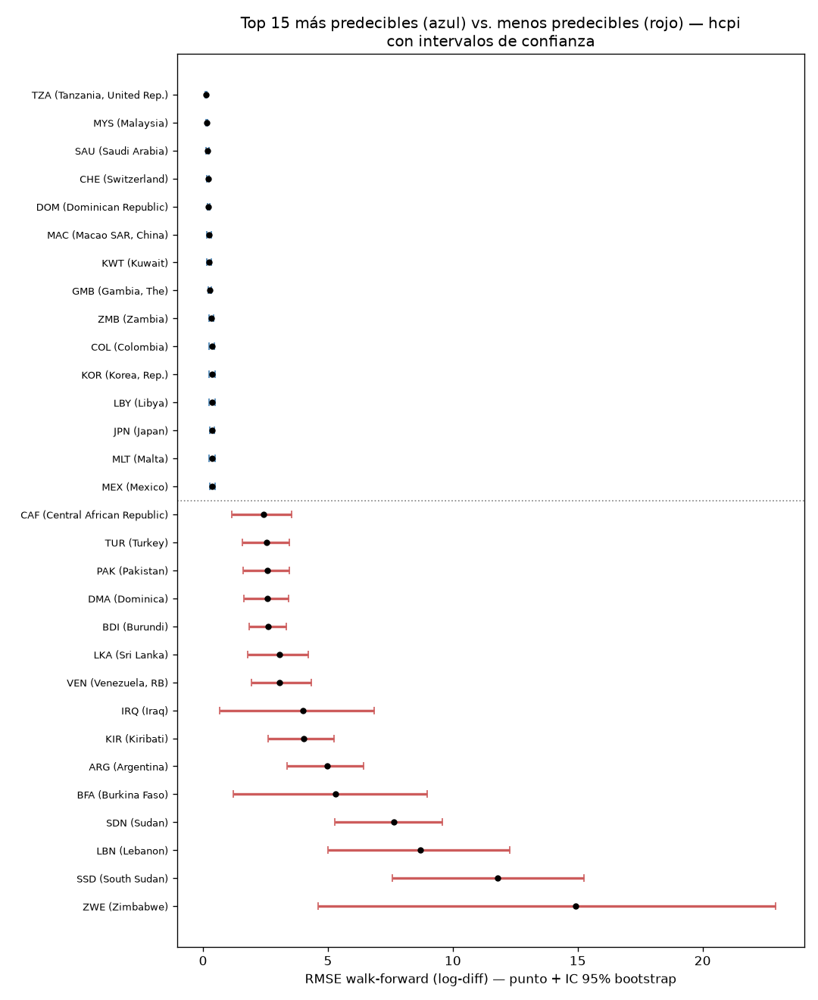
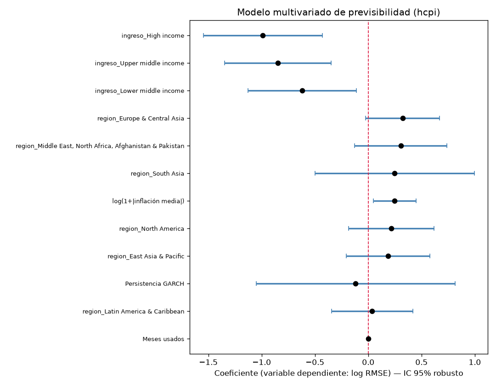

# Previsibilidad y volatilidad de la inflación global

Análisis de series de tiempo (ARIMA) y de volatilidad (GARCH) sobre la inflación mensual de **188 países**, usando el *Global Database of Inflation* del Banco Mundial. El objetivo no es "predecir la inflación" — es responder una pregunta más interesante y más honesta: **¿qué tan predecible es la inflación, y de qué depende esa previsibilidad?**

## Resumen ejecutivo

Este proyecto ajusta un modelo ARIMA (previsibilidad de nivel) y un GARCH(1,1) (persistencia de volatilidad) por separado a cada una de ~640-676 series país×indicador (headline CPI, CPI núcleo, energía, alimentos y productor), evaluados con validación walk-forward contra un baseline ingenuo (random walk). El pipeline corre en paralelo con `joblib` sobre una notebook, sin infraestructura distribuida — una decisión de ingeniería deliberada, no una limitación (ver más abajo).

El hallazgo central: **la previsibilidad de la inflación tiene un gradiente claro por nivel de ingreso del país, y ese gradiente sobrevive a cuatro intentos independientes de tirarlo abajo** — controlando por longitud de la serie disponible, por inflación media, y dentro de un modelo multivariado con todas las variables a la vez. No es un artefacto de que los países ricos simplemente tengan más datos.

Pero el proyecto también se tomó en serio la posibilidad de estar equivocado: incluye una **auditoría metodológica propia** que midió el impacto de un posible data leakage en la selección de modelos (no lo encontró) y cuantificó con bootstrap cuánta incertidumbre hay en el ranking de previsibilidad país por país (mucha — la lectura honesta es en grupos, no en un orden estricto). Esa autocrítica documentada es, en sí misma, parte del resultado.

## Hallazgos principales

### 1. El gradiente de previsibilidad por nivel de ingreso es real, no un artefacto de longitud de datos

El RMSE walk-forward mediano baja monótonamente de países de bajos ingresos a altos ingresos (1.70 → 0.85 → 0.70 → 0.54), y la diferencia es estadísticamente significativa (Kruskal-Wallis, H=31.85, **p=5.6×10⁻⁷**).

El problema obvio: los países ricos también tienen series más largas (correlación ingreso↔longitud, ρ=0.49), y más datos generalmente producen mejores ajustes. Se puso a prueba esa hipótesis de dos formas independientes:

- **Correlación parcial** de ingreso↔RMSE controlando por longitud de serie: ρ=-0.33, **p=7.9×10⁻⁶** (sobrevive).
- **Truncamiento**: se recortaron las 174 series de headline CPI a una longitud común (48 meses) y se re-corrió todo el modelado desde cero. El gradiente persistió: Kruskal-Wallis **p=2.3×10⁻⁶**.
- **Modelo multivariado** (ver hallazgo 5): controlando simultáneamente por inflación media, longitud, región y persistencia GARCH, las tres categorías de ingreso siguen siendo significativas y monótonas.



### 2. Lo que vuelve impredecible a un país no es "cuánta" inflación tiene, sino su forma

La hipótesis obvia — "a mayor inflación, menor previsibilidad" — no se sostiene como relación general: ni el nivel de inflación correlaciona significativamente con si un país le gana al baseline ingenuo (Mann-Whitney p=0.54; Spearman continuo p=0.18), ni la correlación parcial inflación↔RMSE controlando por ingreso es significativa (p=0.17).

Mirando de cerca las 59 series con inflación media >20%, la razón aparece clara: **Argentina, Venezuela y Lituania** (inflación alta pero con una **tendencia sostenida** que un modelo lineal puede seguir) están entre las series donde ARIMA más le gana al random walk (ratio hasta 0.42). **Zimbabwe, Sudán del Sur y Letonia** (inflación alta pero con **saltos discontinuos y cambios de régimen abruptos**) están entre las que menos gana (ratio hasta 1.72). Es la forma de la volatilidad, no su magnitud, lo que determina si un modelo lineal tiene algo que agarrar.

### 3. El CPI núcleo es más predecible que el headline — pero eso no significa que sus shocks se disipen más rápido

Excluir alimentos y energía sí mejora la previsibilidad de nivel, de forma sistemática y significativa: comparando el mismo país en ambos indicadores, el CPI núcleo tiene menor RMSE walk-forward que el headline (Wilcoxon pareado, n=76 países, **p=3.3×10⁻⁹**). Energía y alimentos son, cada uno por separado, significativamente más volátiles que el núcleo (p=5.8×10⁻¹¹ y p=3.4×10⁻¹², respectivamente), y ese orden de previsibilidad (Núcleo > Headline > Alimentos > Productor > Energía) se repite país por país, no es solo un patrón de promedios (test de Friedman, n=57 países, **p=3.9×10⁻³⁰**).

Pero acá aparece un resultado que **contradice la intuición de "mirar a través" de los shocks de energía/alimentos en política monetaria**: la persistencia de volatilidad GARCH (alpha+beta) **no difiere significativamente entre los 5 indicadores** (Kruskal-Wallis, p=0.12). Que el CPI núcleo sea más predecible en *nivel* no implica que los shocks de energía/alimentos se disipen más rápido en *volatilidad* — son cosas distintas, y la evidencia de este panel no respalda que esos shocks sean sistemáticamente más transitorios.



### 4. Previsibilidad de nivel y persistencia de volatilidad son dimensiones independientes

Un país cuya inflación es difícil de pronosticar (RMSE alto) no es necesariamente un país con volatilidad persistente (GARCH alpha+beta alto). La correlación entre ambas es, directamente, cero (Spearman ρ=-0.007, **p=0.93**), y el gradiente de ingreso que gobierna la previsibilidad de nivel no se repite para la persistencia de volatilidad (Kruskal-Wallis p=0.15 por ingreso, p=0.38 por región). "Imprevisible en nivel" e "imprevisible en volatilidad" son dos preguntas distintas que exigen dos modelos distintos — exactamente por eso este proyecto los trata por separado (ARIMA y GARCH), en vez de asumir que uno implica el otro.



### 5. El ranking honesto es de grupos, no de un orden país-a-país

Cada RMSE walk-forward viene de apenas 24 observaciones de evaluación — tiene incertidumbre, y reportarlo como un número puntual exacto es engañoso. Se calculó un intervalo de confianza por bootstrap (1000 iteraciones) para cada una de las 174 series de headline, y el resultado es contundente: **de los 173 pares de países consecutivos en el ranking completo, el 0% tiene intervalos que no se solapan.** Ningún país es "significativamente" más predecible que su vecino inmediato en la tabla.

Lo que sí es real: los extremos. Un país del top 15 y uno del bottom 15 tienen intervalos claramente separados. La lectura correcta del ranking de previsibilidad no es "Tanzania es #1, Malasia es #2" — es "hay un grupo de países consistentemente más predecibles y un grupo consistentemente menos predecibles, con una zona ancha e indistinguible en el medio".



Poniendo todo junto en un modelo multivariado (OLS, errores robustos HC3, n=171, solo headline) — `log(RMSE) ~ ingreso + inflación media + longitud de serie + región + persistencia GARCH` — el modelo explica **31.5% de la varianza** en previsibilidad (R²). El ingreso sobrevive intacto y monótono (los tres coeficientes de ingreso son significativos, de -0.62 a -0.99 en log-RMSE frente a países de bajos ingresos), la inflación media aporta información propia más allá del ingreso, la longitud de serie sigue siendo significativa aunque con un coeficiente chico, y ni la región ni la persistencia GARCH resultan significativas una vez controlado todo lo demás.



## Metodología

**Fuente de datos**: *Global Database of Inflation* del Banco Mundial (Ha, Kose & Ohnsorge), un Excel único con 6 indicadores de precios (headline, energía, alimentos, núcleo, productor, deflactor) en frecuencia mensual/trimestral/anual para ~190 países desde 1970. Se usaron los 5 indicadores con frecuencia mensual (el deflactor solo existe trimestral/anual). Clasificación de país (región, nivel de ingreso) enriquecida vía la API del Banco Mundial.

**Diagnóstico exhaustivo antes de modelar** (`reports/fase1_*.md` a `fase5_*.md`): 5 fases de auditoría de la fuente separadas explícitamente de la corrección, cada una un script reproducible que documenta hallazgos sin tocar los datos. Encontraron y documentaron: duplicados de país en varias hojas (36 casos), filas que ya vienen como tasa en vez de índice (India/Indonesia en energía), un caso de índice congelado en cero mal codificado (Venezuela), series con desfasaje de frecuencia (mensual/trimestral mezclado), y la decisión de usar `log-diff` en vez de `pct_change` para el modelado (log-diff es numéricamente más estable en episodios de hiperinflación — el mismo evento real en Venezuela midió 344.272% en `pct_change` contra 814% en `log-diff`).

**Corrección del ETL** (`src/05_etl_corregido.py`): incorpora los 10 hallazgos de diagnóstico — deduplicación con flag de trazabilidad, ramificación por tipo de indicador real, tratamiento de ceros como dato faltante, doble columna de transformación (`pct_change` interpretable + `log-diff` para modelar), flags de calidad (`apto_arima`, `apto_garch`, `alta_inflacion`) sin borrar ninguna fila.

**Modelado**: `auto_arima` (pmdarima) por serie, `d∈{0,1,2}`, `p,q∈{0..5}`, selección por AICc; GARCH(1,1) (`arch`) sobre los residuos del ARIMA, con `rescale=True` para manejar hiperinflación numéricamente. La evaluación es **walk-forward**: ventana de 24 meses, forecast a 1 paso con origen móvil, re-estimando el orden completo cada 6 pasos. Contra esto se compara siempre un **baseline ingenuo** (random walk: "el próximo valor es el último observado") — la prueba de honestidad de si el modelo aporta algo sobre lo trivial.

**Auto-auditoría metodológica** (`reports/auditoria_metodologica.md`, `robustez_multivariado.md`): antes de confiar en los hallazgos, se midió el impacto de dos debilidades metodológicas identificadas (data leakage en selección de orden, longitud de serie como confusor) en vez de asumirlas o descartarlas, y se cuantificó la incertidumbre del ranking con bootstrap. Ambos análisis concluyeron que los hallazgos principales son robustos — pero el proceso de verificarlo, no solo la conclusión, es parte de lo que este repo documenta.

## Decisión de ingeniería: `joblib`, no PySpark

Se evaluó explícitamente usar PySpark (como en un proyecto hermano de este mismo autor que sí lo usa, con datos anuales) y se descartó acá, de forma deliberada:

- **Volumen real**: ~676 series, ~217.000 filas en el parquet completo — entra sin problema en la memoria de una notebook.
- **Costo por serie**: ajuste ARIMA+GARCH en ~2-8 segundos por serie según complejidad. El pipeline completo de modelado (640 series, walk-forward incluido) corre en **~11 minutos** en 22 cores.
- Spark está diseñado para volumen que no entra en una máquina, o cómputo distribuido en cluster. Acá ninguna de las dos condiciones aplica: sería overhead de gestión de cluster y serialización sin ningún beneficio, para un problema que es "muchas tareas chicas e independientes en una sola máquina" — exactamente el caso de uso de `joblib` con backend `loky`.

Elegir la herramienta más simple que resuelve el problema, documentando por qué, es la decisión de ingeniería correcta acá — y se revirtió a propósito respecto del proyecto hermano, no por default.

## Limitaciones honestas

- **Panel no balanceado por diseño**: no se excluyó a ningún país por tener historia corta — el desbalance (algunos países con 663 meses de datos, otros con 60) es intencional, para no sesgar la muestra hacia economías estables. Esto significa que las comparaciones entre países no son "de igual a igual" en términos de cantidad de información disponible, aunque la Parte 2 de la auditoría confirma que esto no explica el hallazgo central.
- **Algunas series de alto interés nunca llegan a modelarse en GARCH**: el piso de 100 meses sin huecos internos que exige `apto_garch` deja afuera a Argentina (headline, 86 meses) y a Venezuela (energía/alimentos/headline, 70-79 meses) — no por ser demasiado volátiles (de hecho, las series de estos mismos países que sí cumplen el piso convergen sin problema, varias en el borde IGARCH), sino por cobertura de datos insuficiente.
- **Un solo tipo de modelo por dimensión**: ARIMA lineal para el nivel, GARCH(1,1) simétrico para la volatilidad. No se probaron variantes no lineales (ver "Trabajo futuro").
- **Componente estacional no explotado**: Fase 5 encontró que ~26% de las series tienen una señal estacional propia genuina (PACF en lag 12 significativa, controlando por la persistencia general de la serie) — el pipeline actual no usa SARIMA en ningún caso, ni siquiera en ese subconjunto.
- **El ranking país-a-país tiene más incertidumbre de la que aparenta** (ver hallazgo 5) — cualquier consumo de este repo que use el ranking de Análisis A como una lista ordenada exacta está sobre-interpretando el resultado.

## Trabajo futuro

- **Modelos de volatilidad asimétricos** (EGARCH, GJR-GARCH): el GARCH(1,1) simétrico no distingue si un shock de inflación viene de una sorpresa al alza o a la baja — plausiblemente relevante dado que la inflación tiene una asimetría estructural (es más fácil que se acelere de golpe a que se frene de golpe).
- **Contagio entre países** (VAR / cointegración): este proyecto modela cada serie de forma independiente. Una pregunta natural siguiente es si shocks de inflación en un país predicen shocks en sus socios comerciales o vecinos regionales.
- **Dimensión temporal**: ¿cambió la previsibilidad de la inflación después de la adopción de metas de inflación explícitas en los 90? El panel tiene la profundidad histórica (desde 1970) para testear esto con un diseño de quiebre estructural.
- **Variables explicativas institucionales externas**: independencia del banco central, régimen cambiario, apertura comercial — el modelo multivariado actual (R²=0.315) deja bastante varianza sin explicar, y la literatura de economía monetaria sugiere que estos factores importan.

## Estructura del repo

```
data/raw/                  Excel crudo del Banco Mundial (se descarga, no se versiona a mano)
data/processed/            Parquets intermedios y finales
src/                        Scripts, numerados por orden de ejecución (ver abajo)
reports/                    Un informe .md por fase/análisis + reports/figures/
run_pipeline.py             Corre todo el pipeline de punta a punta
requirements.txt            Dependencias congeladas
```

### Scripts — pipeline vs. diagnóstico

**Pipeline** (generan los resultados finales; `run_pipeline.py` los corre en este orden):

| Script | Qué hace |
|---|---|
| `src/01_descarga_datos.py` | Descarga el Excel del Banco Mundial a `data/raw/` (si no existe ya) |
| `src/05_etl_corregido.py` | ETL corregido — índice/tasa por tipo real, ceros de Venezuela, doble transformación, flags de calidad |
| `src/06b_modelado_robusto.py` | ARIMA+GARCH con walk-forward + baseline naive, paralelizado (el paso lento, ~11 min) |
| `src/07_enriquecer_clasificacion.py` | Enriquece con región/nivel de ingreso (API del Banco Mundial) |
| `src/08_analisis_previsibilidad.py` | Análisis A: ranking, gradiente de ingreso, hiperinflación |
| `src/09_analisis_estructura.py` | Análisis B: headline vs. componentes |
| `src/10_analisis_volatilidad.py` | Análisis C: dinámica de volatilidad GARCH |
| `src/11_auditoria_metodologica.py` | Auditoría: leakage de orden ARIMA + longitud como confusor |
| `src/12_robustez_multivariado.py` | Robustez: intervalos de confianza bootstrap + modelo multivariado |

**Diagnóstico** (ya cumplieron su función exploratoria; sus hallazgos quedaron documentados en `reports/faseN_*.md`, no hace falta re-ejecutarlos para reproducir los resultados finales):

- `src/fase1_entender_fuente.py` … `src/fase5_series_tiempo.py` — las 5 fases de auditoría de la fuente, previas a la corrección del ETL.
- `src/02_calidad_series.py` — chequeo de calidad temprano, superseded por Fase 3.
- `src/06_modelado_arima_garch.py` — primera versión del modelado (hold-out único de 12 meses); reemplazada por `06b` (walk-forward), se conserva para comparar.

### Cómo reproducir

```bash
python -m venv venv
venv\Scripts\activate          # Windows
pip install -r requirements.txt
python run_pipeline.py         # ~20-25 minutos, el paso de modelado domina el tiempo
```

Cada script del pipeline es además ejecutable de forma independiente (`python src/08_analisis_previsibilidad.py`, etc.) si solo se quiere reproducir un análisis puntual sobre los parquets ya generados.

**Verificación de reproducibilidad**: se corrió `run_pipeline.py` de punta a punta desde cero (15.0 minutos, los 9 pasos OK) y se comparó cada `.md` y `.parquet` regenerado contra lo ya versionado en el repo — **coincidieron byte a byte, sin ninguna diferencia**, incluyendo el gradiente de ingreso (Kruskal-Wallis p=5.6×10⁻⁷), la comparación núcleo vs. headline (Wilcoxon p=3.3×10⁻⁹), la correlación parcial del confusor de longitud (p=7.9×10⁻⁶) y los coeficientes del modelo multivariado. Es el resultado esperable: no hay aleatoriedad sin semilla fija en ningún paso (los muestreos de la auditoría y el bootstrap usan semillas fijas) y los optimizadores de ARIMA/GARCH son determinísticos dada la misma entrada.
